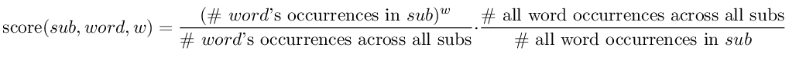

# reddit-analyzer
Analyzes reddit comments to run various statistics


## scraper
`scraper` is a command-line tool that fetches reddit comments and builds a JSON map of words to how many times each
word is seen, organized by subreddits.

### Usage
`-c CONFIG_FILE -d DATA_FILE -s SUBMISSION_LIMIT -C COMMENT_LIMIT -p TIME_PERIOD -m MODE SUBREDDITS_LIST...`

- **CONFIG_FILE**: YAML file read in by `scraper` that must contain the following information for the reddit API:
```yaml
appId: <reddit app id>
appVersion: <reddit app version>
clientId: <reddit app client id>
clientSecret: <reddit app client secret key>
username: <reddit username>
```
- **DATA_FILE**: JSON file that `scraper` will store its output in. If this file already contains output from a
previous `scraper` execution, it will be appended.
- **SUBMISSION_LIMIT**: Maximum number of reddit submissions to fetch.
- **COMMENT_LIMIT**: Maximum number of comments per submission to fetch.
- **TIME_PERIOD**: Time period from which to fetch reddit submissions. `{all, year, month, week, day, hour}`
- **MODE**: `scraper`'s execution mode. If omitted, `default` mode is used.
  - `default`: Words are counted normally, as many times as they appear.
  - `comment`: Each word is only counted once per comment (if a comment contains the same word multiple times, the word
  will only be counted once).
- **SUBREDDITS_LIST**: Space-separated list of subreddit names to fetch data from, not including the `/r/` or `r/`.


## analyzer
`analyzer` is a command-line tool that runs statistics on the JSON data output by `scraper` and creates another
JSON file that lists each subreddit's most distinguishing words, as compared to all other subreddits it analyzes.

### Usage
`-d DATA_FILE -o OUTPUT_FILE -l LIMIT -w WEIGHT_EXPONENT`

- **DATA_FILE**: JSON file generated by `scraper` to analyze.
- **OUTPUT_FILE**: JSON file to write results to. This file is overwritten.
- **LIMIT**: Maximum number of most distinguishing words to list for each subreddit.
- **WEIGHT_EXPONENT**: Exponent to use in the following formula to give each word its "score":


